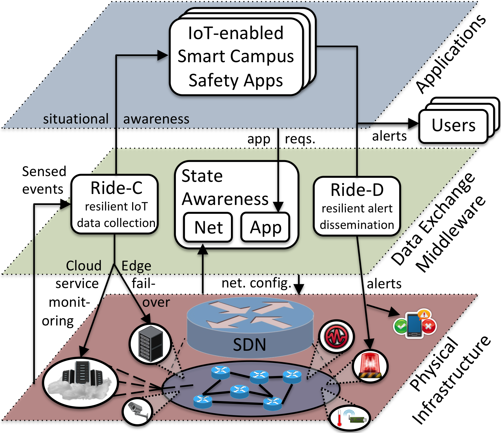
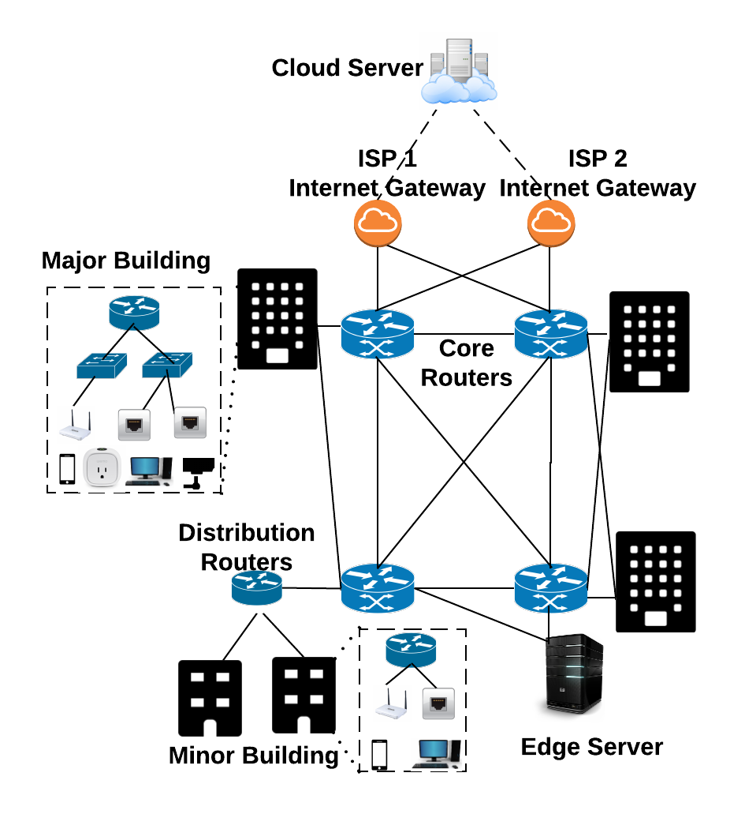

# Resilient IoT Data Exchange (Ride)

Resilient IoT Data Exchange (Ride) leveraging SDN and edge computing.
It extends existing publish-subscribe-oriented IoT data exchanges without client modifications to facilitate resilient real-time event-collection and emergency alert dissemination despite prevalent network failures and congestion (e.g. due to a severe earthquake).
The first phase, Ride-C, leverages programmable SDN-enabled infrastructure for gathering and utilizing network-awareness to improve IoT data collection.
It monitors cloud data paths (overlay links from the local smart campus network to the cloud IoT service) for failures/degraded quality and rapidly switches over to another available one (if available) or to the backup edge service.
The second phase, Ride-D, uses this information to disseminate time critical alerts via an intelligent network and application-aware multicast mechanism.
It pre-computes multiple Maximally-Disjoint Multicast Trees (MDMTs) for the registered subscribers and alert topic, installs them to the SDN data plane, and intelligently selects the best for alert dissemination based on current network state.

This repository includes the algorithms, prototype implementation, SDN controller REST API adapter, and Mininet-based experimental framework we used to evaluate its performance.
The [docs](docs/) folder contains further documentation, including [implementation decision notes](docs/IMPLEMENTATION_NOTES.md) and a list of [TODOs/future work](docs/TODO.md).

Refer to [this link for the formal research paper](http://www.ics.uci.edu/~dsm/papers/2018/ride-iotdi-2018.pdf) that presents Ride and please cite it as:

Kyle E. Benson, Guoxi Wang, Young-Jin Kim, and Nalini Venkatasubramanian. "Ride: A Resilient IoT Data Exchange Middleware Leveraging SDN and Edge Cloud Resources". *in Proceedings of 2018 ACM/IEEE Third International Conference on Internet-of-Things Design and Implementation (IoTDI)*, Orlando, Florida, USA, 2018.

## Getting Started

Follow the [installation instructions](docs/INSTALL.md) to install Ride.

## Architecture and Workflow

See [Architecture and Workflow](docs/ARCHITECTURE.md) for details about how Ride works.

## Experimental Setup

We used the [mininet](http://mininet.org/) framework for experimenting with Ride in an SDN-enabled setting using real networking stacks.  We developed an automated test tool that:

1. Builds a mininet topology from a given input file.
2. Configures clients and servers according to the example scenarios being considered.
3. Runs the experiment.
4. Adapts the network configuration according to dynamics: failures, loss rates, etc.
5. Outputs results for consumption by a parsing script.

### Running experiments

See [run.py](run.py) for a script that defines multiple configurations and automatically runs each of them.  It parallelizes the experiments (runs multiple instances to make use of multi-core systems) if not using Mininet.

To directly define and run a single experiment via command line, see the `[mininet|networkx]_smart_campus_network_experiment.py` files.  Run one of them with the `-h` flag for a list of configurable options.

Alternatively, you can also manage these configurations through the `config` module (e.g. config.py or defaults.py).

### Smart campus network topology generator

See the [campus_topo_gen.py](campus_topo_gen.py) script for how we generate random campus network topologies according to the following hierarchical structure, which we base off real-world campus networks:

## Example scenarios

### Seismic alerting service

To show an example scenario and study Ride's effectiveness in a motivating realistic scenario, we implemented a seismic alerting service that gathers ground shaking data from IoT sensors, detects possible earthquakes, and issues alerts to interested subscribers (i.e. human users or actuating devices).
This application, based on the [Community Seismic Network (CSN) concept](http://csn.caltech.edu/), is built around our multi-purpose IoT system called SCALE.
See the [SCALE Client integration notes](docs/SCALE_CLIENT_INTEGRATION.md) for details.

### Smart Fire Fighting

We are currently extending Ride's capabilities to include dynamic event prioritization for use in a Smart Fire Fighting setting.  See the *sci-fire* branch for information about that project.
