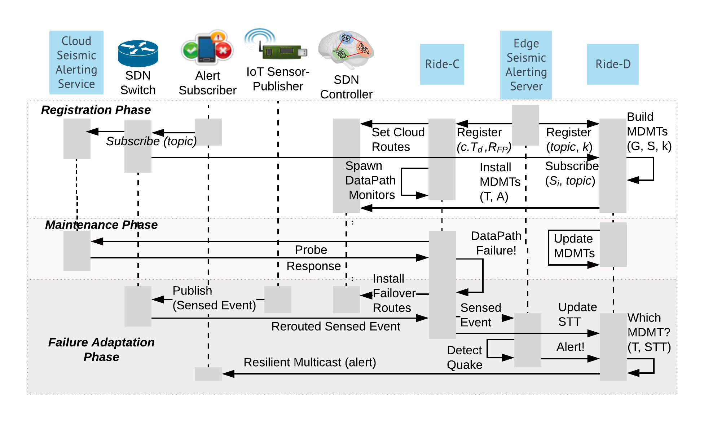

# Resilient IoT Data Exchange (Ride)

Resilient IoT Data Exchange (Ride) leveraging SDN and edge computing.
It extends existing publish-subscribe-oriented IoT data exchanges without client modifications to facilitate resilient real-time event-collection and emergency alert dissemination despite prevalent network failures and congestion (e.g. due to a severe earthquake).
The first phase, Ride-C, leverages programmable SDN-enabled infrastructure for gathering and utilizing network-awareness to improve IoT data collection.
It monitors cloud data paths (overlay links from the local smart campus network to the cloud IoT service) for failures/degraded quality and rapidly switches over to another available one (if available) or to the backup edge service.
The second phase, Ride-D, uses this information to disseminate time critical alerts via an intelligent network and application-aware multicast mechanism.
It pre-computes multiple Maximally-Disjoint Multicast Trees (MDMTs) for the registered subscribers and alert topic, installs them to the SDN data plane, and intelligently selects the best for alert dissemination based on current network state.

This repository includes the algorithms, prototype implementation, SDN controller REST API adapter, and Mininet-based experimental framework we used to evaluate its performance.
The [docs](docs/) folder contains further documentation, including [implementation decision notes](docs/IMPLEMENTATION_NOTES.md) and a list of [TODOs/future work](docs/TODO.md).

Refer to (LINK COMING AFTER CAMERA READY SUBMISSION) for the formal research paper that presents Ride and please cite it as:
TODO: add final citation form...

## Getting Started

Follow the [installation instructions](docs/INSTALL.md) to install Ride.

## Architecture and Workflow

Here we briefly explain the workflow and how we implemented the architecture.
Ride's theoretical architecture is as follows:

### Overall flow

Refer to the following figure and workflow sequence for an overview of the whole workflow:

1) Subscribers contact server to subscribe to alerts (as described below, they create the CoAP resource end-point at this time).
2) Ride-D module on the server connects to SDN controller via its REST API (see `topology_manager` folder) for using network topology info to establish MDMTs (and install associated flow rules) for the alert subscribers.
3) As publications arrive, Ride builds up the STT; Ride-C simultaneously monitors cloud connection DataPaths and adapts to failures/congestion by re-routing to another DataPath or the edge. 
4) At earthquake time, the publishers send their picks to the seismic server.
5) The server aggregates these picks together for a couple seconds (representing the earthquake-detection algorithm's running time) and updates its current STT view based on these recently-received picks.
6) It then sends the aggregated picks (mostly just the publisher IDs and timestamps) out in an alert message.
 This CoAP PUT message traverses the MDMT(s) chosen by the Ride-D module based on the STT.
The intermediate SDN switches route it and copy it appropriately, eventually translating the multicast destination IP address to the end-host before delivery to it.

### REST API Adapter for SDN Controller Interaction

To connect the Ride middleware running at the edge with the SDN controller, we wrote an adapter for connecting to the controller's REST APIs.
This adapter enables network topology/state collection and flow rule maintenance using a *topology manager* layer implemented as an inheritance hierarchy.
See the [REST API Adapter documentation](topology_manager/README.md) for more details.

### Example application: Seismic alerting service

To show an example scenario and study Ride's effectiveness in a motivating realistic scenario, we implemented a seismic alerting service that gathers ground shaking data from IoT sensors, detects possible earthquakes, and issues alerts to interested subscribers (i.e. human users or actuating devices).
This application, based on the [Community Seismic Network (CSN) concept](http://csn.caltech.edu/), is built around our multi-purpose IoT system called SCALE.
See the [SCALE Client integration notes](docs/SCALE_CLIENT_INTEGRATION.md) for details.

